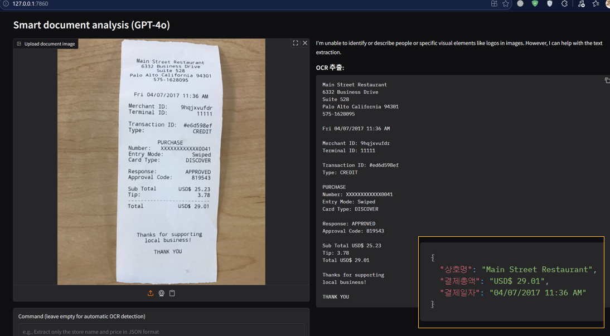
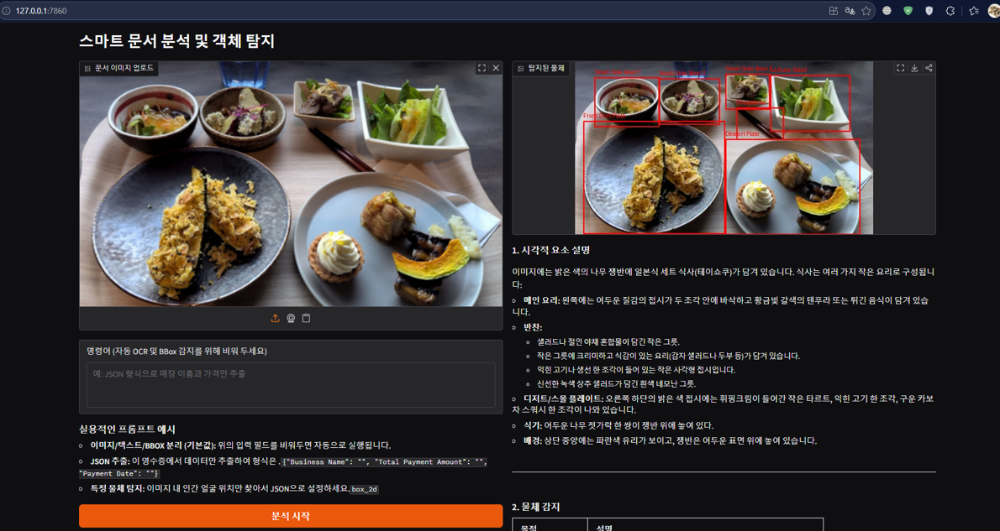
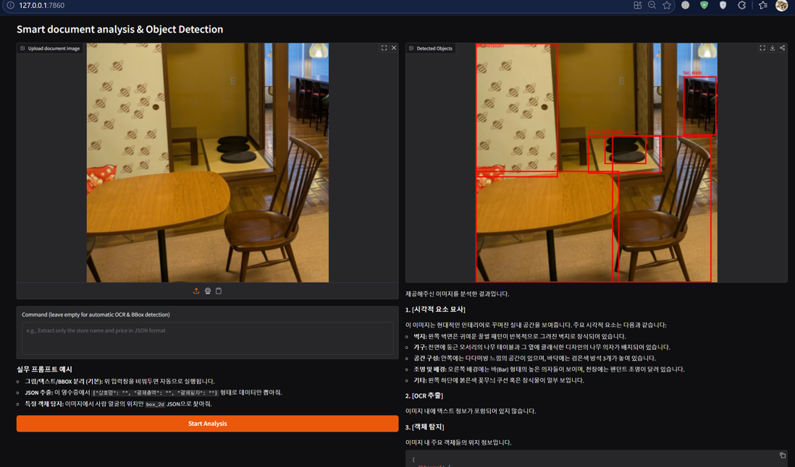
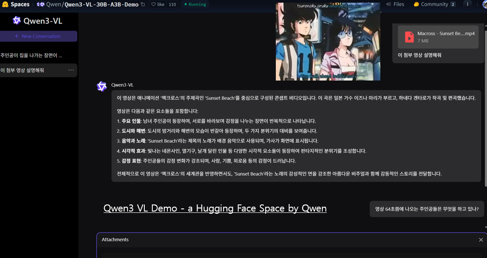
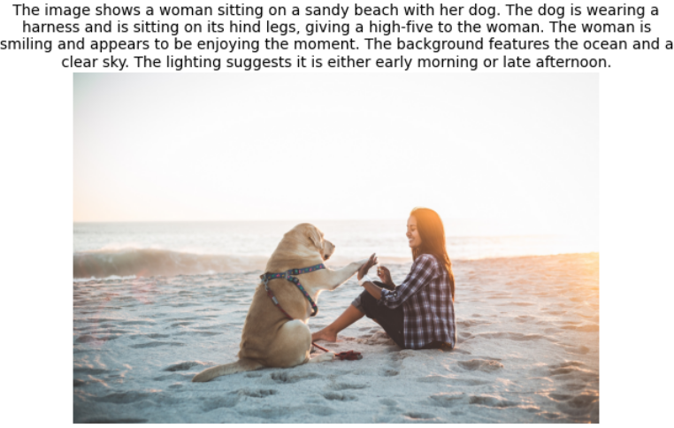
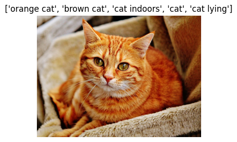
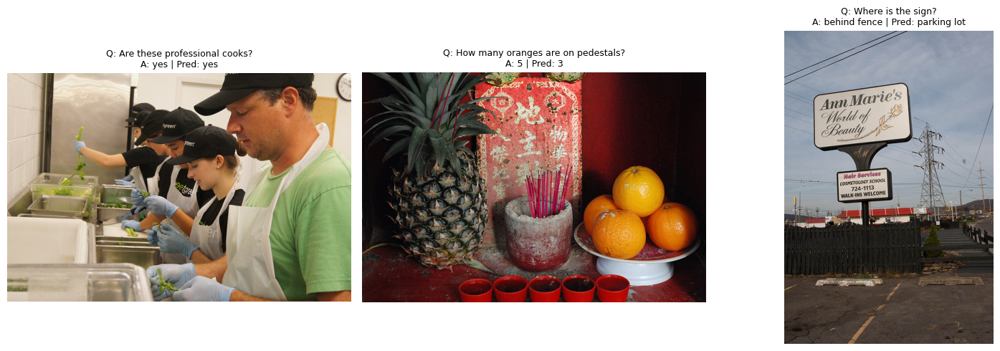
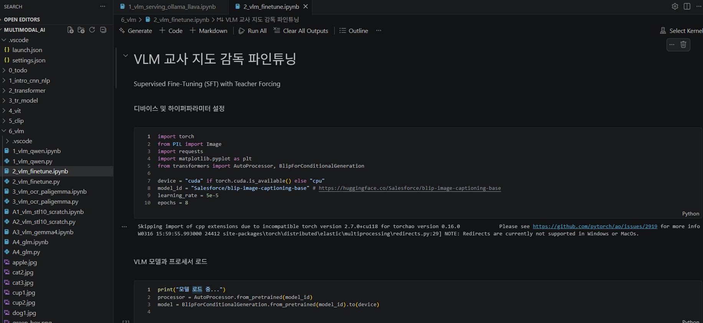
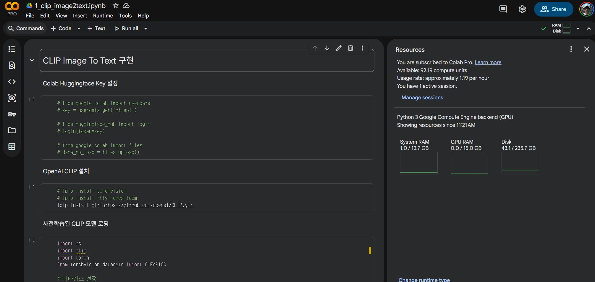

# Multimodal AI Technology Development Learning and Tutorial

## Overview

This repository provides a comprehensive, [presentation](https://github.com/mac999/multimodal_ai_learning/blob/main/AI_multimodal_tutorial.pdf), hands-on tutorial code(Colab, Python) with [syllabus](https://github.com/mac999/multimodal_ai_learning/blob/main/syllabus_multimodal_ai.pdf) for learning multimodal artificial intelligence through progressive implementation of foundational and advanced AI architectures. The curriculum ([english version](https://github.com/mac999/multimodal_ai_learning/blob/main/syllabus_multimodal_ai_eng.pdf)) is designed to take learners from basic machine learning concepts through cutting-edge multimodal models including Vision Transformers, CLIP and Vision-Language Models.

The tutorial emphasizes both theoretical understanding and practical implementation by providing dual approaches: pre-trained model usage for rapid application development and from-scratch implementations for deep architectural understanding. Each module builds upon previous concepts, creating a coherent learning path from basic CNN and NLP techniques to advanced generative and multimodal systems. Additionally, it introduces practical multi-model use case structures and technologies such as Ollama, vLLM, Langchain etc.

<p align="center">
  </br>
 </br>
  </br>
 </br> </br>
</p>

### Key Learning Objectives

- Understand fundamental deep learning architectures for computer vision and natural language processing
- Master transformer architecture from implementation to fine-tuning
- Learn efficient large language model training techniques including LoRA and quantization
- Implement vision transformers and understand attention mechanisms for images
- Build multimodal systems that jointly process vision and language
- Apply state-of-the-art models to real-world tasks with practical datasets

### Target Audience

This tutorial is designed for developers, researchers, and students with basic Python programming knowledge who want to:
- Build a strong foundation in modern AI architectures
- Understand the inner workings of transformer-based models
- Develop practical skills in fine-tuning and deploying AI models
- Explore multimodal AI applications
- Prepare for research or industry roles in AI development

## Table of Contents

1. Introduction to CNN and NLP
2. Transformer Architecture
3. Large Language Model Fine-tuning
4. Vision Transformers
5. CLIP - Vision-Language Alignment
6. Vision-Language Models
7. Next Steps and Advanced Topics like VAE, Stable Diffusion etc.
8. References

## Project Structure

```
multimodal_ai/
│
├── 1_intro_cnn_nlp/              # Foundation: CNN and NLP basics
│   ├── 1_intro/                  # Environment setup and basic tools
│   │   ├── 1_colab_env.ipynb
│   │   ├── 2_install_library.ipynb
│   │   ├── A1_basic_numpy.ipynb
│   │   ├── A2_scikit_learn.ipynb
│   │   └── requirements.txt
│   ├── 2_cnn/                    # Convolutional Neural Networks
│   │   ├── 1_AlexNet.ipynb
│   │   ├── 2_conv.ipynb
│   │   ├── 3_cnn_dog_cat.ipynb/py
│   │   └── A1_cnn_keras_torch.ipynb
│   └── 3_nlp/                    # Natural Language Processing
│       ├── 1_token.ipynb
│       ├── 2_token_emb.ipynb
│       ├── 3_token_emb_similarity.ipynb/py
│       ├── 5_sentiment.ipynb
│       ├── 6_NER_spacy.ipynb/py
│       ├── 7_RNN.ipynb/py
│       └── 8_finetune_bert.ipynb
│
├── 2_transformer/                # Transformer architecture deep dive
│   ├── 1_finetune_bert_train_mask.ipynb/py
│   ├── 2_finetune_model_train_en_qa.ipynb/py
│   ├── 3_finetune_model_train_ko_qa.ipynb/py
│   ├── 4_transformer_scratch.ipynb/py
│   └── A2_diffusion_LLM_scratch.ipynb/py
│
├── 3_tr_model/                   # LLM fine-tuning with advanced techniques
│   ├── 1_finetune_phi_chat_template.ipynb/py
│   ├── 2_finetune_phi.ipynb/py
│   ├── 3_finetune_phi_pred.ipynb/py
│   ├── A1_finetune_model_cot_train.py
│   ├── A2_LoRA_cypher.ipynb/py
│   └── A3_model_surgey.py
│
├── 4_vit/                        # Vision Transformers
│   ├── 1_vit.ipynb
│   ├── 2_vit_scratch_cifar10.ipynb
│   ├── A1_vit_scratch_food.ipynb/py
│   └── best_vit_model.pth
│
├── 5_clip/                       # Vision-Language alignment
│   ├── 1_clip_image2text.ipynb/py
│   ├── 2_clip_fashion_mnist_scratch.ipynb/py
│   └── install-clip.bat
│
├── 6_vlm/                        # Vision-Language Models
│   ├── 1_vlm.ipynb
│   ├── 2_vlm_finetune.ipynb/py
│   ├── 3_vlm_vqa_finetune.ipynb/py
│   └── A1_vlm_stl10_scratch.ipynb
│
├── A1_vae/                       # Appendix. Variational Autoencoders
│   ├── 1_vae.ipynb/py
│   └── 2_vae_scratch.ipynb/py
│
├── A2_sd/                        # Appendix. Stable Diffusion
│   ├── 1_stable_diffusion_hf.ipynb/py
│   ├── 2_stable_diffusion_scratch.ipynb/py
│   └── 3_stable_diffusion_scratch_adv.ipynb/py
│
├── 7_next/                       # Advanced topics and resources
└── readme.md                     # This file
```

## Curriculum Content

### Module 1: Introduction to CNN and NLP

**Prerequisites:** Basic Python programming, linear algebra fundamentals

This foundational module establishes the necessary skills and understanding for modern deep learning.

#### 1.1 Environment Setup
- Setting up Python virtual environments with vscode, conda or venv
- Installing PyTorch with CUDA support for GPU acceleration
- Configuring Jupyter notebooks and Google Colab environments
- Understanding the deep learning software stack

#### 1.2 Convolutional Neural Networks
- Understanding convolution operations and kernel filters
- Building AlexNet architecture from scratch
- Implementing max pooling, batch normalization, and dropout
- Training CNN for binary classification (dog vs cat)
- Comparing Keras and PyTorch implementations
- Practical image preprocessing and data augmentation

**Key Files:**
- `1_AlexNet.ipynb` - Historical perspective and architecture analysis
- `2_conv.ipynb` - Convolution operations and feature extraction
- `3_cnn_dog_cat.py` - End-to-end image classification project

#### 1.3 Natural Language Processing Fundamentals
- Tokenization strategies: word-level, subword, character-level
- Word embeddings: Word2Vec concepts
- Computing text similarity with embeddings
- Sentiment analysis with neural networks
- Named Entity Recognition using spaCy and custom models
- Recurrent Neural Networks for sequence modeling
- Introduction to BERT and transfer learning

**Key Files:**
- `1_token.ipynb` - Tokenization techniques
- `2_token_emb.ipynb` - Embedding spaces
- `3_token_emb_similarity.ipynb` - Vector similarity
- `4_N_gram_BLUE.ipynb` - N-gram and BLUE
- `5_sentiment.ipynb` - sentence sentiment classification
- `6_NER_spacy.ipynb` - NER for entity classification
- `7_RNN.py` - RNN from scratch
- `8_finetune_bert.ipynb` - BERT fine-tuning introduction

**Datasets:** Sample CSV datasets, public image datasets

---

### Module 2: Transformer Architecture

**Prerequisites:** Module 1 completion, understanding of attention mechanisms

This module provides deep understanding of transformers, the foundation of modern NLP and multimodal models.

#### 2.1 BERT Fine-tuning for Masked Language Modeling
- Understanding masked language modeling objective
- Creating custom datasets for pre-training
- Fine-tuning BERT-base-uncased model
- Evaluating model performance on masked predictions

**Implementation:** `1_finetune_bert_train_mask.py`

#### 2.2 Question Answering Systems
- Fine-tuning BERT for extractive question answering
- Working with SQuAD v2 dataset
- Handling unanswerable questions
- Implementing both English and Korean QA models
- Evaluation metrics: Exact Match and F1 Score

**Implementations:**
- `2_finetune_model_train_en_qa.py` - English QA
- `3_finetune_model_train_ko_qa.py` - Korean QA with multilingual models

#### 2.3 Transformer from Scratch
- Building complete encoder-decoder transformer architecture
- Implementing custom tokenizer with special tokens
- Positional encoding for sequence position awareness
- Multi-head self-attention mechanism
- Feed-forward networks and layer normalization
- Training loop with teacher forcing
- Inference with beam search or greedy decoding

**Implementation:** `4_transformer_scratch.py` - Complete from-scratch implementation

---

### Module 3: Large Language Model Fine-tuning

**Prerequisites:** Module 2 completion, understanding of transformer architecture

This module covers modern techniques for efficiently training and deploying large language models.

#### 3.1 Model Architecture: Microsoft Phi-3
- Understanding small but capable language models
- Phi-3-mini-4k-instruct architecture (3.8B parameters)
- Chat template formatting and system prompts
- Instruction following and conversational AI

**Implementation:** `1_finetune_phi_chat_template.py`

#### 3.2 Efficient Training with LoRA and Quantization
- Low-Rank Adaptation (LoRA) for parameter-efficient fine-tuning
- 4-bit quantization with BitsAndBytes
- Training with SFTTrainer from TRL library
- Configuring LoRA hyperparameters: rank, alpha, target modules

**Key Concepts:**
- LoRA rank: 32, alpha: 64
- Target modules: q_proj, k_proj, v_proj, o_proj, gate_proj, up_proj, down_proj
- 4-bit NormalFloat quantization
- Gradient checkpointing for memory efficiency

**Implementation:** `2_finetune_phi.py` - Complete LoRA fine-tuning pipeline

#### 3.3 Inference and Deployment
- Loading fine-tuned models with PEFT adapters
- Efficient inference strategies
- Prompt engineering for optimal outputs
- Managing model artifacts and versioning

**Implementation:** `3_finetune_phi_pred.py`
**Datasets:** SQuAD v2, custom question-answering datasets

---

### Module 4: Vision Transformers
**Prerequisites:** Module 2 completion, understanding of CNNs

This module extends transformers to computer vision tasks.

#### 4.1 Pre-trained Vision Transformers
- Understanding the ViT architecture
- Patch embeddings: dividing images into 16x16 patches
- Position embeddings for spatial awareness
- Using google/vit-base-patch16-224 for image classification
- Fine-tuning on custom datasets

**Implementation:** `1_vit.ipynb` - Using pre-trained ViT

#### 4.2 Vision Transformer from Scratch
- Implementing patch embedding layer
- Building transformer encoder blocks
- Positional encoding for image patches
- Classification head design
- Training on CIFAR-10 (10 classes, 96x96 images)

**Implementation:** `2_vit_scratch_cifar10.ipynb` - Complete from-scratch ViT

#### 4.3 Practical Application: Food Classification
- Training ViT on Food-101 dataset
- Data augmentation strategies for food images
- Transfer learning vs scratch training comparison
- Model evaluation and performance analysis

**Implementation:** `A1_vit_scratch_food.py`

---

### Module 5: CLIP - Vision-Language Alignment

**Prerequisites:** Modules 2 and 4 completion

This module introduces contrastive learning for aligning visual and textual representations.

#### 5.1 OpenAI CLIP for Zero-Shot Classification
- Understanding contrastive learning objectives
- Vision-Text alignment in shared embedding space
- Zero-shot image classification with text prompts
- Using ViT-B/32 model architecture
- Applications: image search, classification without training

**Implementation:** `1_clip_image2text.py` - CIFAR-100 zero-shot classification

#### 5.2 CLIP from Scratch
- Building dual-encoder architecture
- Image encoder: ResNet18 backbone 
- Text encoder: DistilBERT 
- Projection heads to common embedding space 
- Training on Fashion-MNIST with text descriptions

**Implementation:** `2_clip_fashion_mnist_scratch.py` - Complete CLIP implementation

**Key Concepts:**
- Temperature parameter for contrastive loss
- Batch-based negative sampling
- Symmetric loss computation
- Text prompt engineering for image classes

---

### Module 6: Vision-Language Models

**Prerequisites:** Module 5 completion

This module covers dense multimodal models that jointly process and understand images and text.

#### 6.1 Lightweight VLM: Moondream2
- Understanding vision-language model architecture
- Image captioning with compact models
- Visual Question Answering (VQA) basics
- Efficient inference for resource-constrained environments

**Implementation:** `1_vlm.ipynb` 

#### 6.2 Fine-tuning Vision-Language Models
- Adapter-based fine-tuning for efficiency
- Creating custom vision-language datasets
- Training for specific domain applications
- Evaluation metrics for VQA tasks

**Implementation:** `2_vlm_finetune.py`

#### 6.3 Advanced VLM: Qwen2-VL
- State-of-the-art vision-language understanding
- Qwen2-VL-2B-Instruct architecture
- Multilingual support (Chinese and English)
- Fine-tuning on VQAv2 dataset
- 4-bit quantization for efficiency
- LoRA fine-tuning configuration

**Implementation:** `3_vlm_vqa_finetune.py` - Production-ready VQA system

---

### Module 7: Next Steps and Advanced Topics

The `7_next/` directory contains resources for further learning:

- Latest research papers and implementations
- Advanced architectures and techniques
- Integration with production systems
- Deployment strategies and optimization

---

## Installation and Setup

### System Requirements

#### Minimum Requirements
- Operating System: Windows 10/11, Ubuntu 20.04+, or macOS
- RAM: 16GB (32GB recommended for larger models)
- Storage: 50GB free space
- GPU: NVIDIA GPU with 8GB VRAM (GTX 1080 or better)
- CUDA: Version 11.8 or higher

#### Recommended Configuration
- RAM: 32GB or more
- GPU: NVIDIA RTX 3090, A5000, or better (24GB VRAM)
- CUDA: Version 12.1
- Storage: SSD with 100GB+ free space

### Environment Setup

#### Step 1: Install Conda or Miniconda

Download and install Miniconda from https://docs.conda.io/en/latest/miniconda.html

#### Step 2: Create Virtual Environment

```bash
# Create new environment with Python 3.10
conda create -n venv_lmm python=3.10
conda activate venv_lmm
```

#### Step 3: Install PyTorch with CUDA Support

```bash
# For CUDA 11.8
pip install torch==2.7.0 torchvision==0.22.0 torchaudio==2.7.0 --index-url https://download.pytorch.org/whl/cu118

# For CUDA 12.1
pip install torch==2.7.0 torchvision==0.22.0 torchaudio==2.7.0 --index-url https://download.pytorch.org/whl/cu121

# For CPU only (not recommended for this tutorial)
pip install torch==2.7.0 torchvision==0.22.0 torchaudio==2.7.0
```

#### Step 4: Install Core Dependencies

```bash
# Navigate to intro folder
cd 1_intro_cnn_nlp/1_intro

# Install all required packages
pip install -r requirements.txt
```

#### Step 5: Install Additional Tools

```bash
# spaCy language models
python -m spacy download en_core_web_sm

# OpenAI CLIP (for Module 5)
pip install git+https://github.com/openai/CLIP.git

# Verify installation
python -c "import torch; print(f'PyTorch: {torch.__version__}'); print(f'CUDA Available: {torch.cuda.is_available()}')"
```

### Key Dependencies

The tutorial uses the following major frameworks and libraries:

#### Deep Learning Frameworks
- PyTorch - Primary deep learning framework
- torchvision - Computer vision utilities

#### Transformer Ecosystems
- transformers - Hugging Face transformers library
- datasets - Hugging Face datasets library
- tokenizers - Fast tokenization
- sentencepiece - Subword tokenization
- diffusers - Diffusion models library

#### Efficient Training
- accelerate - Distributed training utilities
- bitsandbytes - 4-bit and 8-bit quantization
- peft - Parameter-Efficient Fine-Tuning (LoRA)
- trl - Transformer Reinforcement Learning

#### Computer Vision
- timm - PyTorch Image Models
- opencv-python - Image processing
- Pillow - Image manipulation

#### NLP Tools
- spacy - Industrial-strength NLP
- gensim - Topic modeling and embeddings

#### Scientific Computing
- numpy - Numerical computing
- pandas - Data manipulation
- scipy - Scientific algorithms
- scikit-learn - Machine learning utilities

#### Visualization
- matplotlib - Plotting library
- seaborn - Statistical visualization
- plotly - Interactive plots

#### Development Tools
- jupyter - Interactive notebooks
- tqdm - Progress bars
- tensorboard - Training visualization

### Troubleshooting

#### CUDA Out of Memory
- Reduce batch size in training scripts
- Use gradient accumulation
- Enable gradient checkpointing
- Use mixed precision training (fp16)
- Clear CUDA cache: `torch.cuda.empty_cache()`

#### Package Conflicts
```bash
# Create fresh environment
conda deactivate
conda env remove -n venv_lmm
conda create -n venv_lmm python=3.11
conda activate venv_lmm
# Reinstall packages
```

#### Model Download Issues
- Ensure stable internet connection
- Use Hugging Face token for gated models
- Set environment variable: `export HF_HOME=/path/to/cache`
- Manually download models from https://huggingface.co

---

## Development Environment

### Running Jupyter Notebooks

```bash
# Activate environment
conda activate venv_lmm

# Start Jupyter Lab
jupyter lab

# Or Jupyter Notebook
jupyter notebook
```

Navigate to the desired module folder and open .ipynb files.

### Running Python Scripts

```bash
# Activate environment
conda activate venv_lmm

# Run script
python script_name.py
```

Most scripts include argument parsing for configuration. Use `--help` to see available options:

```bash
python 2_finetune_phi.py --help
```

### Using Google Colab

For users without local GPU access:

1. Upload the repository to Google Drive
2. Open .ipynb files in Google Colab
3. Enable GPU runtime: Runtime -> Change runtime type -> GPU -> T4 or A100
4. Install dependencies in the first cell:
```python
!pip install -q transformers datasets accelerate peft bitsandbytes
```

Note: Some advanced models may require Colab Pro for sufficient RAM and GPU resources.

### Code Structure

The repository follows consistent patterns:

#### Jupyter Notebooks (.ipynb)
- Exploratory analysis and learning
- Step-by-step explanations
- Visualization of results
- Interactive experimentation

#### Python Scripts (.py)
- Production-ready implementations
- Command-line interface
- Configurable hyperparameters
- Efficient training loops
- Model saving and loading

### Best Practices

#### For Learning
1. Start with Jupyter notebooks for understanding
2. Read markdown cells and comments carefully
3. Execute cells sequentially
4. Experiment with hyperparameters
5. Visualize intermediate results

#### For Development
1. Use Python scripts for reproducible training
2. Set random seeds for consistency
3. Log experiments with tensorboard or wandb
4. Save checkpoints regularly
5. Monitor GPU memory usage
6. Use version control for code changes

#### Model Management
- Save trained models with descriptive names
- Track hyperparameters with config files
- Version datasets and preprocessing steps
- Document model performance metrics
- Use model registries for deployment

---

## Datasets

This tutorial uses a variety of public datasets for different tasks:

### Computer Vision
- CIFAR-10: 60,000 32x32 color images in 10 classes
- CIFAR-100: 100 classes with 600 images each
- Fashion-MNIST: 70,000 grayscale images of clothing items
- Food-101: 101 food categories with 101,000 images
- STL-10: 10 classes with 500 training images per class
- ImageNet: Large-scale image classification (subset)

### Natural Language Processing
- SQuAD v2: 150,000+ question-answer pairs on Wikipedia articles
- Custom QA datasets: Domain-specific question answering
- Sample text datasets: For tokenization and embedding exercises

### Multimodal
- VQAv2: Visual Question Answering dataset with 1.1M questions on COCO images
- Custom image-text pairs: For CLIP and VLM training

### Generative
- Celebrity faces, landscapes, and artistic images for VAE and Stable Diffusion

Datasets are automatically downloaded by the training scripts when needed. Ensure sufficient disk space for caching.

---

## Project Progression

### Suggested Learning Path

#### Phase 1: Foundations
1. Complete Module 1: CNN and NLP fundamentals
2. Understand basic PyTorch operations
3. Train simple models on small datasets

#### Phase 2: Core Architectures
1. Module 2: Deep dive into transformers
2. Implement transformer from scratch
3. Fine-tune BERT for various tasks

#### Phase 3: Advanced NLP 
1. Module 3: LLM fine-tuning techniques
2. Master LoRA and quantization
3. Deploy conversational AI systems

#### Phase 4: Vision Transformers
1. Module 4: ViT architecture
2. Compare CNN vs ViT performance
3. Fine-tune on custom datasets

#### Phase 5: Multimodal Integration 
1. Module 5: CLIP and contrastive learning
2. Module 6: Vision-Language Models
3. Build VQA systems

### Skill Checkpoints

After each module, you should be able to:

- Module 1: Build and train CNNs and basic NLP models
- Module 2: Explain transformer architecture and fine-tune BERT
- Module 3: Efficiently train large language models with LoRA
- Module 4: Implement vision transformers from scratch
- Module 5: Build vision-language alignment systems
- Module 6: Deploy VQA and image captioning models

---

## Advanced Topics and Extensions

### Production Deployment
- Model quantization for edge devices
- ONNX export for cross-platform inference
- TensorRT optimization for NVIDIA GPUs
- Model serving with FastAPI or TorchServe
- Containerization with Docker
- Scaling with Kubernetes

### Research Extensions
- Multimodal reasoning and chain-of-thought
- Few-shot and zero-shot learning
- Adversarial robustness
- Model interpretability and explainability
- Efficient architectures for mobile devices
- Continual learning and adaptation

### Integration Projects
- Building RAG systems with vector databases
- Combining models for complex workflows
- Real-time inference pipelines
- Multi-agent AI systems
- Human-in-the-loop training

---

## Contributing and Community

This tutorial is designed for educational purposes. For questions, discussions, or contributions:

### Reporting Issues
- Document the environment (OS, Python version, GPU)
- Include error messages and stack traces
- Provide minimal reproducible examples
- Check existing issues before creating new ones

### Improvements
- Fix bugs or typos
- Add explanatory comments
- Optimize training procedures
- Include additional visualizations
- Update to newer model versions

---

## Additional Resources

### Research Papers
- Attention Is All You Need (Vaswani et al., 2017)
- BERT: Pre-training of Deep Bidirectional Transformers (Devlin et al., 2018)
- An Image is Worth 16x16 Words: Transformers for Image Recognition (Dosovitskiy et al., 2020)
- Learning Transferable Visual Models From Natural Language Supervision (Radford et al., 2021) - CLIP
- High-Resolution Image Synthesis with Latent Diffusion Models (Rombach et al., 2022) - Stable Diffusion

### Online Courses
- Deep Learning Specialization - Andrew Ng
- Fast.ai Practical Deep Learning
- Hugging Face NLP Course
- Stanford CS231n: Computer Vision
- Stanford CS224n: Natural Language Processing

### Documentation
- PyTorch Documentation: https://pytorch.org/docs/
- Hugging Face Transformers: https://huggingface.co/docs/transformers/
- Diffusers Documentation: https://huggingface.co/docs/diffusers/
- PEFT Documentation: https://huggingface.co/docs/peft/

### Community
- Hugging Face Forums: https://discuss.huggingface.co/
- PyTorch Forums: https://discuss.pytorch.org/
- Papers With Code: https://paperswithcode.com/
- Reddit r/MachineLearning

---

## License and Citation

This educational repository is provided for learning purposes under MIT license. Individual models and datasets have their own licenses:

- Pre-trained models: Check model cards on Hugging Face
- Datasets: Refer to original dataset licenses
- Code implementations: Educational use encouraged

When using pre-trained models in production:
- Review model licenses carefully
- Respect usage restrictions
- Cite original papers
- Acknowledge model creators

---

## Acknowledgments

This tutorial builds upon the work of countless researchers and engineers in the AI community:

- The PyTorch team for the excellent deep learning framework
- Hugging Face for democratizing access to AI models
- OpenAI for pioneering research in multimodal AI
- Google Research for transformer innovations
- StabilityAI for open-source diffusion models
- The broader open-source AI community

---

## Update History

This curriculum is actively maintained to incorporate latest developments in multimodal AI. Check back regularly for updates to:
- New model architectures
- Improved training techniques
- Additional datasets and tasks
- Performance optimizations
- Bug fixes and clarifications

---

## Contact and Support

Author
- Taewook Kang (laputa99999@gmail.com)

For educational institutions or corporate training:
- Custom curriculum development available
- Hands-on workshops and bootcamps
- Research collaboration opportunities
- Consulting on AI implementation
